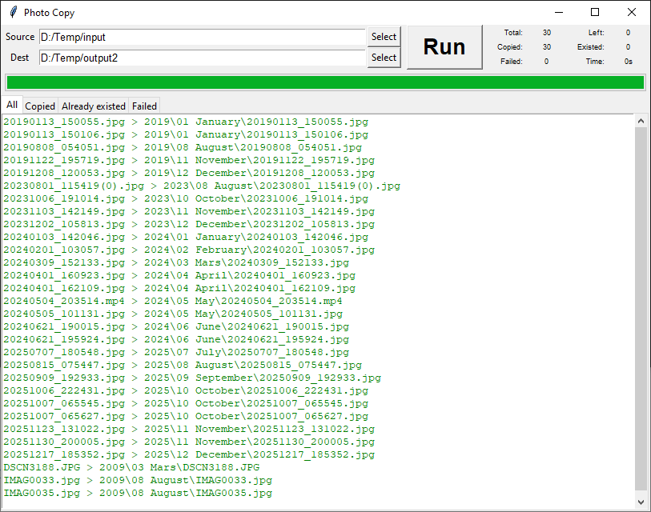

# Photocopy

Utility to copy and organize files (such as photos).

The utility copies all files (recursive) in a source directory to a destination directory. 
The destination file will look like this:

    <year>/<month>/<filename>

Year and month is based on the file creation date.

This utility is very stable and robust and will omit files that was not possibly to copy 
of any reason. 

# Usage

You need python version 3 or later.

Simplest is to use the GUI version:

	python photocopy_gui.py

Alternatively use the command line version:

	python photocopy.py [-h] src dst

	positional arguments:
	  src         Source directory
	  dst         Destination directory

# Configuration

You can configure the name of the month directories as you wish by modifying the file:

	photocopy.ini

The file must be in the same directory as the python files.

